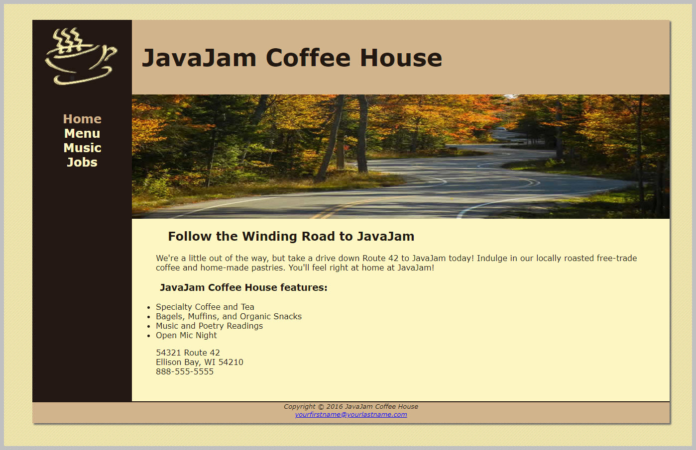

# Attachments

# Instructions
<ol>
    <li>use the pdf posted to brightspace showing the 'old' Java Jam page</li>
    <li>create a wireframe based on <strong>that</strong> layout</li>
    <li>make the html of the page together as a team - talk it through</li>
    <li>each person should make <strong>their own version</strong> of CSS for the Java Jam Page (each version should be posted even if not used entirely on the final page - include each member's version as a zip)</li>
    <li>show each other what you did, decide as a team what parts of each member's css will end up in the final site</li>
    <li>make the print stylesheet for the site to save ink/toner</li>
    <li>finalize one css stylesheet and attach it to your JavaJam page. Zip it and call it FinalSite.zip</li>
    <li>Post your zips here well before the due date/time</li>
</ol>